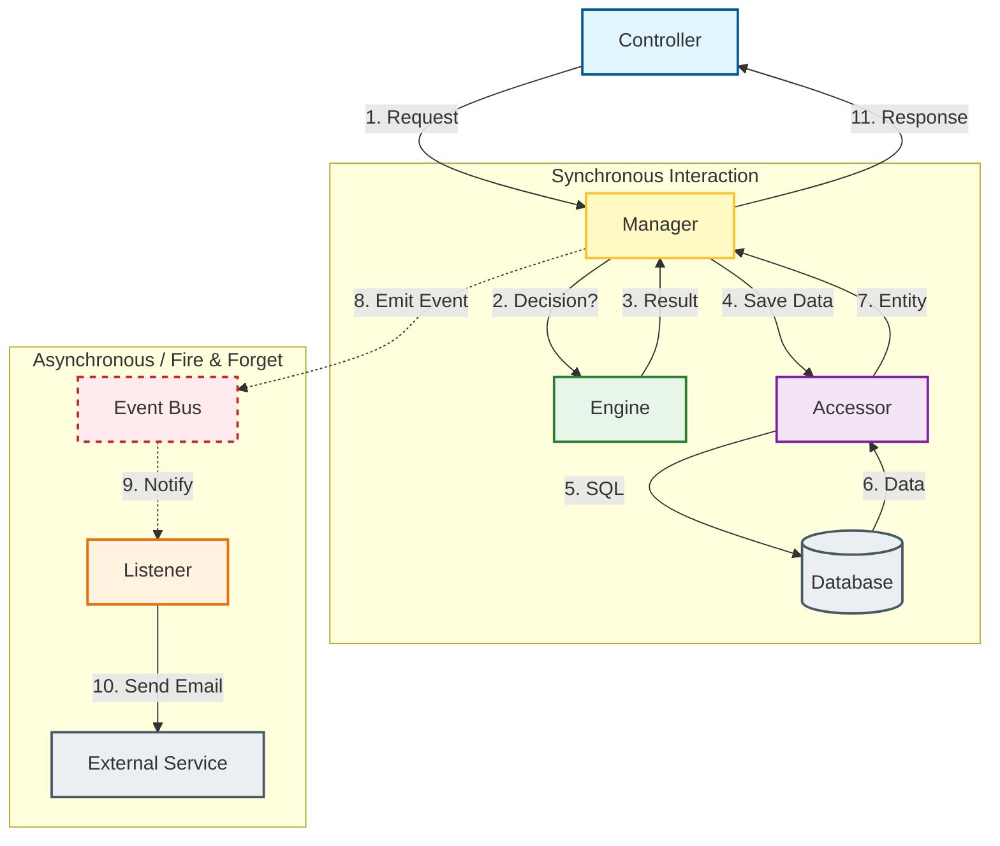
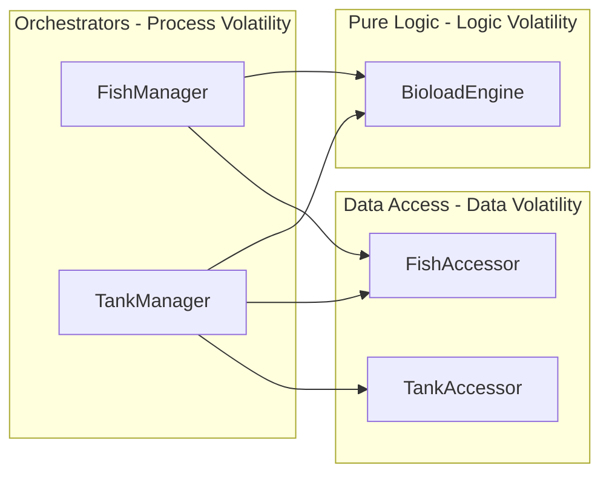

# Architecture Documentation

> **Note**: This document reflects the actual implemented architecture of the `my-aquarium-api` project, which differs from the theoretical structure described in `CLAUDE.md`.

## 1. Architectural Style: Hybrid IDesign (Lowy) + Laravel

The project implements a **Modular Monolith** architecture heavily inspired by Juval Lowy's "Righting Software" (IDesign) Method, blended with Laravel's Developer Experience (DX) patterns.

### Core Philosophy: Volatility-Based Decomposition
The system is decomposed based on **volatility** (what changes), not functionality.

1.  **Accessors (Data Volatility)**: Encapsulate *how* and *where* data is stored. If the DB changes, only Accessors change.
2.  **Engines (Logic Volatility)**: Encapsulate *complex business rules*. If the formula for "Fish Compatibility" changes, only the Engine changes.
3.  **Managers (Process Volatility)**: Encapsulate the *workflow/sequence*. If the user journey changes (e.g., "Send email after registration" -> "Send SMS"), only the Manager changes.

---

## 2. Directory Structure

```
src/
├── core/                  # Shared utilities, base classes, and mixins
│   ├── accessors/         # Base Accessor interfaces/mixins
│   ├── contracts/         # Global interfaces
│   ├── entities/          # Base Entity definitions
│   └── mixins/            # Core Mixin factories (Model, Accessor)
│
├── modules/               # Feature Modules
│   ├── fish-care/
│   │   ├── accessors/     # Data Access Layer
│   │   ├── engines/       # Business Logic Layer (Complex Rules) <-- NEW
│   │   ├── managers/      # Process/Workflow Layer
│   │   ├── entities/      # Domain Layer (Rich Models)
│   │   ├── requests/      # Input Validation
│   │   └── fish-care.module.ts
```

---

## 3. Key Components & Patterns

### A. Entities (The "Model")
**Role**: Rich domain objects, state holders.
**Pattern**: Extends `Model<PrismaType>()`.
- **Auto-Mapping**: Properties inferred from Prisma.
- **Rich Behavior**: Handles internal state consistency (e.g., `assignToUser`).

### B. Accessors (Data Access)
**Role**: Encapsulate volatile **Data Access**.
**Pattern**: Extends `Accessor(Entity)`.
- Replaces "Repositories".
- **Rule**: Managers/Engines must NEVER access Prisma directly. They must use Accessors.

### C. Engines (Business Logic)
**Role**: Encapsulate volatile **Business Logic** & Rules.
**Pattern**: Pure(ish) logic classes.
- **Responsibility**: "How to calculate X", "Is Y allowed", "Algorithm Z".
- **Rule**: Engines do NOT call other Engines (usually). Engines do NOT handle HTTP/Requests.

```typescript
// Example: src/modules/fish/engines/compatibility.engine.ts
@Injectable()
export class CompatibilityEngine {
    calculateStressLevel(fish: Fish, tank: Tank): number {
        // Complex logic: Bioload + Param mismatch + Aggression
        if (tank.volume < fish.minVolume) return 100;
        return 0;
    }
}
```

### D. Managers (Process/Workflow)
**Role**: Encapsulate volatile **Use Cases / Workflow**.
**Pattern**: The entry point for features.
- **Responsibility**: Orchestration. "First do A, then check B (Engine), then save C (Accessor)".
- **Rule**: Managers utilize Engines for logic and Accessors for data.

```typescript
// src/modules/fish/managers/fish.manager.ts
@Injectable()
export class FishManager {
    constructor(
        private accessor: IFishAccessor,
        private compatibilityEngine: CompatibilityEngine // Inject Engine
    ) {}

    async addFishToTank(request: AddFishRequest): Promise<Fish> {
        const fish = new Fish().fill(request);
        const tank = await this.tankAccessor.findById(request.tankId);

        // Delegate complex logic to Engine
        if (this.compatibilityEngine.calculateStressLevel(fish, tank) > 50) {
            throw new DomainException("Fish incompatible");
        }

        return this.accessor.save(fish);
    }
}
```

### E. Requests (Input)
**Role**: Define and validate incoming data.
**Pattern**: Laravel-style Form Requests.
- Extends `BaseRequest`.

---

## 4. Flow of Control (The "Call Chain")



1.  **Controller**: Receives HTTP -> Calls Manager.
2.  **Manager**:
    *   orchestrates flow.
    *   calls **Engine** for decisions/calculations.
    *   calls **Accessor** for data I/O.
3.  **Engine**:
    *   executes pure business rules.
    *   returns result to Manager.
4.  **Accessor**:
    *   executes DB query.
    *   returns **Entity** to Manager.
5.  **Manager**: Returns Entity/Result to Controller.

---

## 5. Cross-Module Interaction (The "Glue")

In this Hybrid architecture, Modules are not completely isolated silos. Managers often need data or logic from other modules.

**Rule**: Managers can inject **Accessors** or **Engines** from other modules.
*   **Do NOT** inject other Managers (avoids circular dependency hell).
*   **Do NOT** access other modules' database tables directly (use their Accessor).

### Example: `FishManager` (Module A) uses components from `Tank` & `Species` (Modules B & C)

```typescript
// src/modules/fish/managers/fish.manager.ts
@Injectable()
export class FishManager {
    constructor(
        // 1. Own Module Accessor
        @Inject(FISH_ACCESSOR)
        private readonly fishAccessor: IFishAccessor,

        // 2. EXTERNAL Module Accessor (Checking Tank capacity)
        @Inject(TANK_ACCESSOR)
        private readonly tankAccessor: ITankAccessor,

        // 3. EXTERNAL Module Engine (Checking Species compatibility)
        private readonly speciesCompatibilityEngine: SpeciesCompatibilityEngine
    ) {}

    async addFish(userId: number, request: AddFishRequest): Promise<Fish> {
        // Step 1: Use External Accessor to validate Tank exists & check capacity
        const tank = await this.tankAccessor.findById(request.tankId);
        if (!tank) throw new EntityNotFoundException('Tank', request.tankId);
        
        // Step 2: Use External Engine to check logic
        const isCompatible = this.speciesCompatibilityEngine.canCoexist(
            request.speciesId, 
            tank.inhabitants
        );
        if (!isCompatible) throw new DomainException('Incompatible Species');

        // Step 3: Perform Local Logic
        const fish = new Fish().fill(request).assignToUser(userId);

        // Step 4: Save
        return this.fishAccessor.save(fish);
    }
}
```

### 5.1 Shared Engine for Logic Reuse (Avoiding Duplication)

**Problem**: Multiple Managers need the same business logic. Example:
- `FishManager.addFishToTank()` → Check bioload → Save fish
- `TankManager.createTankWithFish()` → Create tank → Check bioload → Save fish

**❌ Anti-Pattern**: Manager calls Manager (violates architecture, creates circular dependencies).

**✅ Solution**: Extract shared logic to an **Engine**. Both Managers inject the same Engine.



#### Example Implementation

```typescript
// Engine: Pure validation, NO I/O (no Accessor calls)
@Injectable()
export class BioloadEngine {
    validateFishFit(fish: Fish, tank: Tank): void {
        const availableBioload = tank.maxBioload - tank.currentBioload;
        if (fish.bioload > availableBioload) {
            throw new BioloadExceededException(fish.bioload, availableBioload);
        }
    }
}
```

```typescript
// FishManager: Standalone "add fish to existing tank" feature
@Injectable()
export class FishManager {
    constructor(
        @Inject(FISH_ACCESSOR) private fishAccessor: IFishAccessor,
        @Inject(TANK_ACCESSOR) private tankAccessor: ITankAccessor,
        private bioloadEngine: BioloadEngine  // Shared Engine
    ) {}

    async addFishToTank(userId: number, request: AddFishRequest): Promise<Fish> {
        const tank = await this.tankAccessor.findByIdOrFail(request.tankId);
        const fish = new Fish().fill(request).assignToUser(userId);
        
        this.bioloadEngine.validateFishFit(fish, tank);  // ← Shared logic
        
        return this.fishAccessor.save(fish);
    }
}
```

```typescript
// TankManager: "Create tank AND add fish" feature (atomic transaction)
@Injectable()
export class TankManager {
    constructor(
        @Inject(TANK_ACCESSOR) private tankAccessor: ITankAccessor,
        @Inject(FISH_ACCESSOR) private fishAccessor: IFishAccessor,
        private bioloadEngine: BioloadEngine,  // SAME Engine
        private transaction: TransactionHelper
    ) {}

    async createTankWithFish(userId: number, request: CreateTankWithFishRequest): Promise<{tank: Tank, fish: Fish}> {
        return this.transaction.execute(async (tx) => {
            // Step 1: Create tank
            const tank = new Tank().fill(request).assignToUser(userId);
            const savedTank = await this.tankAccessor.withTransaction(tx).save(tank);
            
            // Step 2: Validate fish fit (SAME Engine, no duplicate logic)
            const fish = new Fish().fill(request.fish).assignToUser(userId);
            this.bioloadEngine.validateFishFit(fish, savedTank);
            
            // Step 3: Save fish (atomic - rollback if fails)
            const savedFish = await this.fishAccessor.withTransaction(tx).save(fish);
            
            return { tank: savedTank, fish: savedFish };
        });
    }
}
```

#### Key Rules

| Rule | Explanation |
|------|-------------|
| **Engine = Pure Logic** | No Accessor calls inside Engine. Only validation/calculation. |
| **Manager = Orchestration** | Manager calls Engine for logic, then calls Accessor for persistence. |
| **When Rule Changes** | Update Engine once → All Managers automatically use new logic. |

---

## 6. Event-Driven Side Effects (Hybrid Pattern)

While core business logic is **Synchronous** (Manager -> Engine -> Accessor), we use **Events (Pub/Sub)** for "Fire and Forget" side effects that are not critical to the immediate transaction.

### Rules of Engagement
1.  **Core Logic (Synchronous)**: "Must happen now or fail." (e.g., Saving to DB, Validating Rules).
2.  **Side Effects (Asynchronous)**: "Nice to have, or can happen later." (e.g., Sending Emails, Analytics, Cache Invalidation).

### Real-Life Scenario: "Welcome Email"
**Goal**: When a user creates their first tank, send them a "Getting Started" email.
**Constraint**: The API response should be fast; don't make the user wait for the email service.

#### 1. The Publisher (Manager)
The Manager focuses on the *core task* (saving the tank) and just announces what happened.

```typescript
// src/modules/tank/managers/tank.manager.ts
import { EventEmitter2 } from '@nestjs/event-emitter';

@Injectable()
export class TankManager {
    constructor(
        private accessor: ITankAccessor,
        private eventEmitter: EventEmitter2 // Inject NestJS Event Emitter
    ) {}

    async createTank(userId: number, request: CreateTankRequest): Promise<Tank> {
        // 1. Core Logic (Synchronous) - fast & transactional
        const tank = new Tank().fill(request).assignToUser(userId);
        const savedTank = await this.accessor.save(tank);

        // 2. Publish Domain Event (Fire & Forget)
        // usage: emit('event.name', payload)
        this.eventEmitter.emit(
            'tank.created', 
            new TankCreatedEvent(savedTank)
        );

        return savedTank;
    }
}
```

#### 2. The Subscriber (Listener)
A separate Listener handles the side effect. This code runs in the background (asynchronously) and does not block the Manager.

```typescript
// src/modules/notifications/listeners/tank-created.listener.ts
import { OnEvent } from '@nestjs/event-emitter';

@Injectable()
export class TankCreatedListener {
    constructor(
        private emailService: EmailService
    ) {}

    // Listens for 'tank.created' event
    @OnEvent('tank.created', { async: true }) 
    async handleTankCreatedEvent(event: TankCreatedEvent) {
        const { tank } = event;
        
        // Side Effect Implementation
        console.log(`Sending welcome email for Tank: ${tank.name}`);
        await this.emailService.sendWelcomeEmail(tank.user_id, tank.name);
    }
}
```

---

## 7. Transaction Pattern (Radash-Powered)

For atomic operations spanning multiple Accessors, use `TransactionHelper` with **radash** utilities for clean error handling.

### Key Components

| Component | Purpose | Radash Function |
|-----------|---------|-----------------|
| `TransactionHelper` | Wraps Prisma `$transaction` | `tryit`, `guard` |
| `BaseAccessor.withTransaction()` | Creates transactional accessor copy | `clone` |

### Usage Pattern

```typescript
// Manager orchestrates transaction
import { TransactionHelper } from '@core/database/transaction.helper';

@Injectable()
export class PurchaseManager {
    constructor(
        @Inject(PURCHASE_ACCESSOR) private purchaseAccessor: IPurchaseAccessor,
        @Inject(WALLET_ACCESSOR) private walletAccessor: IWalletAccessor,
        private transaction: TransactionHelper,
    ) {}

    async executePurchase(userId: number, request: PurchaseRequest): Promise<Purchase> {
        // All operations inside execute() are atomic
        return this.transaction.execute(async (tx) => {
            // Step 1: Create purchase
            const purchase = new Purchase().fill(request);
            const savedPurchase = await this.purchaseAccessor
                .withTransaction(tx)
                .save(purchase);

            // Step 2: Update wallet (if this fails, purchase rollbacks)
            const wallet = await this.walletAccessor
                .withTransaction(tx)
                .findByUserId(userId);
            wallet.addGold(request.goldAmount);
            await this.walletAccessor.withTransaction(tx).save(wallet);

            return savedPurchase;
        });
    }
}
```

### TransactionHelper Methods

| Method | Behavior | Use Case |
|--------|----------|----------|
| `execute(callback)` | Throws `DomainException` on failure | Default - fail fast |
| `executeOrNull(callback)` | Returns `null` on failure | Silent fail with fallback |
| `executeOrDefault(default, callback)` | Returns default value on failure | Graceful degradation |

### Radash Integration

```typescript
// TransactionHelper uses radash under the hood:
import { tryit, guard } from 'radash';

// execute() uses tryit for error-first handling
const [err, result] = await tryit(prisma.$transaction)(callback);

// executeOrNull() uses guard for silent failure
const result = await guard(() => prisma.$transaction(callback));

// BaseAccessor.withTransaction() uses clone
import { clone } from 'radash';
const transactionalAccessor = clone(this);
```

### When to Use Transactions

| Scenario | Transaction? | Example |
|----------|--------------|---------|
| Single accessor operation | ❌ No | `tankAccessor.save(tank)` |
| Multiple related creates | ✅ Yes | Tank + Fish + WaterParams |
| Update with validation | ✅ Yes | Check balance → Deduct → Log |
| Read-only operations | ❌ No | `findById`, `findAll` |
